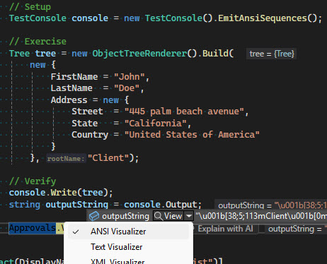

# ANSI Debugger Visualizer for Visual Studio

## Overview

**ANSI Debugger Visualizer** is a Visual Studio Debugger Visualizer that renders ANSI escape sequences directly within the debugging environment, displaying formatted text as it would appear in a console.

### Why this visualizer?

This visualizer was initially developed to streamline the testing and validation of ANSI-rendered output in CLI projects based on Spectre.Console.
When using [ApprovalTests.Net](https://github.com/approvals/ApprovalTests.Net) for unit testing, validating the "approved" file can be cumbersome.

With this visualizer, you can:
- Run the test in debug mode.
- See the ANSI-rendered output directly in Visual Studio.
- Manually confirm if the output matches expectations before approving the received file as the new reference.

Of course, this visualizer can be useful for any scenario involving ANSI-formatted strings.

## Installation

To install the ANSI Debugger Visualizer : 

1. **Copy the DLL into the appropriate Visualizers directory for your Visual Studio version.**
2. **Restart Visual Studio.**

_Note:_
- Default installation path for Visual Studio 2022 (64 bits)
```plaintext
C:\Program Files\Microsoft Visual Studio\2022\<YourEdition>\Common7\Packages\Debugger\Visualizers
```
- Default installation path for Visual Studio 2019 / 2017 (32 bits)
```plaintext
C:\Program Files (x86)\Microsoft Visual Studio\<Year>\<YourEdition>\Common7\Packages\Debugger\Visualizers
```

where :
- _\<YourEdition>_ is `Community`, `Professional` or `Enterprise`
- _\<Year>_ is `2019` or `2017`

## Usage Example

Once installed, the ANSI Debugger Visualizer will be available when debugging a string variable containing ANSI escape sequences.

1. Run your application in Debug mode.
2. Hover over a string variable that contains ANSI-formatted text.
3. Click on the magnifying glass icon 🔍 to open the visualizer.
4. The rendered output will be displayed as if in a terminal.

### Example:

 

These images illustrates how select the visualizer and how the visualizer renders ANSI sequences directly in the debugging window.

## Contributions & Feedback

Contributions, issues, and feature requests are welcome! Feel free to open an issue or submit a pull request.